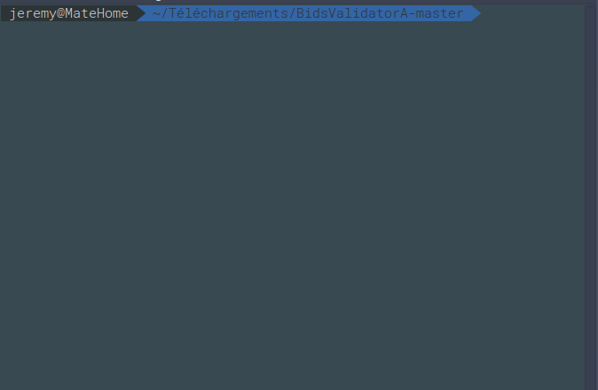
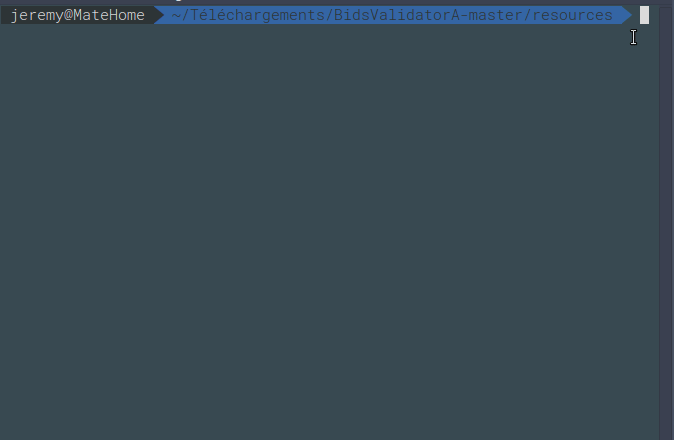

# BidsValidatorA
Bids validator for animal  data structure 


[](https://pypi.python.org/pypi/ansicolortags/)[](https://shields.io/)[](https://www.python.org/)

# Table of Contents
1. [ General usage](#General-usage)
2. [Specific usage](#Specific-usage)
3. [Testing usage](#Testing-usage )
4. [Details](#Details)
# Use
### Clone

- Clone this repo to your local machine using `https://github.com/Slowblitz/BidsValidatorA/tree/V2`
## General usage :
```
usage: BidsValidatorA.py [-h] [-v] path

positional arguments:
  path           Path to your folder

optional arguments:
  -h, --help     show this help message and exit
  -v, --verbose  increase output verbosity

```

## Specific usage :

```
$Python3 resources/BidsValidatorA.py Tests/DataSets/FirstDataSet/Data
```
<p align="center"></p>


OR verbose usage  :
```
$Python3 resources/BidsValidatorA.py Tests/DataSets/FirstDataSet/Data
```

<p align="center"></p>


# Development 
## Testing usage :

```
$cd resources/
$python3.5 -m unittest discover -v
```
## Details :

In resources folder  :

 - file BidsValidatorA.py is the main file 
 - file Error.py is the custom error exception file
 - file BidsEngine.py is the file that verify  with the rules 

In the Rules folder :

 - data_rules.json regex for data rules
 - date_rules.json regex for date rules
 - subject_rules.json regex for subject rules
 - source_rules.json  regex for source rules
## Contributing

> To get started...

### Step 1

- **Option 1**
    - 🍴 Fork this repo!

- **Option 2**
    - 👯 Clone this repo to your local machine using `https://github.com/Slowblitz/BidsValidatorA.git`

### Step 2

- 🔃 Create a new pull request using <a href="https://github.com/Slowblitz/BidsValidatorA/compare/V2" target="_blank">https://github.com/Slowblitz/BidsValidatorA/compare/V2`</a>.

---
 ## Support

Reach out to me at one of the following places!


- Mail at <a href="jeremy.garcia@univ-amu.fr">jeremy.garcia@univ-amu.fr</a>


---

